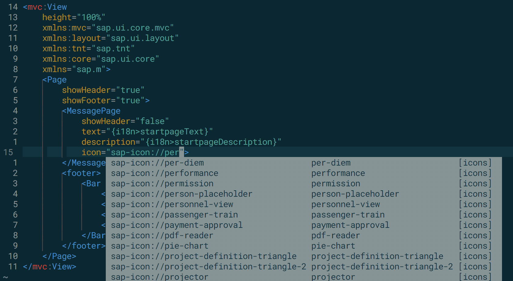

# deoplete-sap-icon

`Deoplete-sap-icon` offers asynchronous completion of icons urls. You can add icons to your code by writing `icon`.
For a full list of available icons and codes, see [Icon Explorer](https://sapui5.hana.ondemand.com/sdk/iconExplorer.html).



## Installation

To install `deoplete-sap-icon`, use your favorite [Neovim](https://neovim.io/) plugin manager.

#### Using [vim-plug](https://github.com/junegunn/vim-plug)

```vim
Plug 'Shougo/deoplete.nvim', {'do': ':UpdateRemotePlugins'}
Plug 'https://innersource.soprasteria.com/NO-Applications-SAP/deoplete-sap-icon.git'
```
